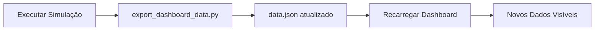

# 🎨 Dashboard MRIO - Guia do Usuário

> **Interface Premium para Visualização de Impactos Econômicos Regionais**

---

## 🚀 Acesso Rápido

### Iniciando o Dashboard

1. **Abra o terminal** no diretório do projeto
2. **Navegue até a pasta do dashboard**:
   ```bash
   cd "c:\Users\jonat\Documents\MIP e CGE\dashboard"
   ```
3. **Inicie um servidor HTTP local**:
   ```bash
   python -m http.server 8000
   ```
4. **Abra no navegador**:
   ```
   http://localhost:8000
   ```

> ⚠️ **Importante**: Devido a restrições de segurança do navegador (CORS), o dashboard **deve ser acessado via servidor HTTP**. Abrir o arquivo `index.html` diretamente não funcionará.

---

## 📱 Interface e Navegação

### Layout Geral

O dashboard é dividido em **3 seções principais**:

```
┌─────────────────────────────────────────────────┐
│ 📊 SIDEBAR                │ CONTEÚDO PRINCIPAL  │
│ • Dashboard               │                     │
│ • Simulations  ←──────────┼─→ Seções Dinâmicas  │
│ • Regional Comparison     │                     │
└─────────────────────────────────────────────────┘
```

### Navegação

**Sidebar Esquerdo**: Clique nos itens para navegar entre seções
- 📊 **Dashboard**: Estatísticas gerais do modelo
- 🎯 **Simulations**: Resultados de eventos específicos
- 🗺️ **Regional Comparison**: Comparação entre regiões

**Scroll Suave**: A navegação utiliza animação suave ao mudar de seção

---

## 🎨 Elementos Visuais

### Animações de Background

- **Partículas Flutuantes**: 50 partículas cyan animadas criando um efeito de profundidade
- **Glow Gradients**: Gradientes animados em roxo e cyan que flutuam suavemente
- **Glassmorphism**: Efeitos de vidro fosco nos cards e sidebar

### Interatividade

#### Cards

- **Hover Effect**: Cards se elevam suavemente ao passar o mouse
- **Progress Bars**: Barras de progresso animadas com efeito shimmer
- **Counters**: Números aparecem com animação "count-up"

#### Navegação

- **Active State**: O item ativo possui barra inferior colorida e ícone em cores vibrantes
- **Smooth Transitions**: Todas as interações possuem transições suaves (0.3s)

#### Gráficos (Chart.js)

- **Tooltips Customizados**: 
  - Fundo escuro semi-transparente
  - Bordas cyan
  - Títulos em destaque
- **Animações de Entrada**: 
  - Duração: 1.5s
  - Easing: `easeInOutQuart`
- **Hover nos Dados**: 
  - Pontos aumentam de tamanho
  - Cores mudam para roxo vibrante

---

## 📊 Seção 1: Dashboard

### Estatísticas Principais

#### **Hero Card - Model Capacity**
- **Título**: 67 Economic Sectors
- **Descrição**: Método FLQ-δ (0.3) calibrado para 2021
- **Tags**: `#SupplyUse` `#MRIO` `#Employment`
- **Visual**: Radar dot animado no canto superior direito

#### **Mini Cards**

1. **📈 Avg Multiplier**
   - Valor: Multiplicador de São Paulo (referência)
   - Sparkline: Visualização gráfica animada
   - Trend: "São Paulo Weighted"

2. **🌎 Total Regions**
   - Valor: 06 macrorregiões
   - Trend: "Macro-regions"

3. **💼 Employment Impact**
   - Valor: Total de empregos gerados nas simulações
   - Formato: "52K+" (arredondado em milhares)

---

## 🎯 Seção 2: Simulations

### Simulação 1: Show da Beyoncé (RJ)

**Badge**: SIMULATION 1 (roxo)

#### **Cabeçalho**
- Título: 🎤 Show da Beyoncé (RJ)
- Choque: R$ 150M

#### **Estatísticas**

1. **Output Impact**
   - Valor: R$ 183M
   - Progress Bar: 78% preenchido (cyan → purple gradient)
   - Indicador: Barra com efeito shimmer animado

2. **Job Creation**
   - Valor: 1,667 postos
   - Badge: "+22% multiplicador" (cyan)

#### **Gráfico: Horizontal Bar**
- **Tipo**: Barras horizontais
- **Dados**: Top 5 setores mais impactados
- **Cor**: Roxo (#A855F7) com transparência
- **Interação**: Barras mudam de opacidade no hover

---

### Simulação 2: Carnaval Spillover

**Badge**: SIMULATION 2 (dourado)

#### **Cabeçalho**
- Título: 🎭 Carnaval Spillover
- Choque: R$ 4B (dourado)

#### **Estatísticas**

1. **Nat. Production**
   - Valor: R$ 5.5B (produção nacional total)
   - Progress Bar: 88% preenchido (gradiente dourado)

2. **Total Leakage**
   - Valor: R$ 655M (cyan, destacado)
   - Badge: "12% spillover" (dourado)

#### **Gráfico: Doughnut**
- **Tipo**: Rosca (70% cutout)
- **Dados**: 
  - Rio (Retained): Cyan
  - Spillover (BR): Roxo
- **Interação**: Segmentos aumentam (hoverOffset: 15px)

#### **Rodapé**
- Pulse Dot Verde: Indicador "live"
- Texto: "~5,811 jobs created outside Rio"

---

## 🗺️ Seção 3: Regional Comparison

### **Cabeçalho**
- Título: Regional Scalability
- Descrição: Ranking de multiplicadores de produção

### **Layout**
```
┌──────────────────┬────────────────────────┐
│  Rank List       │  Line Chart            │
│  (Left Column)   │  (Right Column, maior) │
└──────────────────┴────────────────────────┘
```

### **Rank List (Esquerda)**

Cada item mostra:
- **Nome da Região**: Texto secundário
- **Valor do Multiplicador**: Cyan, grande, Outfit font

**Interação**:
- Hover: Item desliza para direita (10px)
- Border: Cyan aparece no hover
- Background: Cyan semi-transparente
- Barra vertical: Aparece à esquerda (4px cyan)

**Ordem**: Decrescente (maior multiplicador primeiro)

### **Line Chart (Direita)**

- **Tipo**: Linha suave (tension: 0.4)
- **Cor da Linha**: Cyan (#00FFFF), 3px de espessura
- **Preenchimento**: Cyan com 10% de opacidade
- **Pontos**: 
  - Normal: 6px, cyan
  - Hover: 8px, roxo
  - Border: 2px escuro

**Animação de Entrada**: 
- 1.5s
- Easing suave

---

## 🎨 Paleta de Cores

### Cores Primárias
```
--bg-primary: #0a0a0f       (Fundo principal)
--bg-secondary: #12121a     (Fundo secundário)
--accent-cyan: #00FFFF      (Destaque principal)
--accent-purple: #A855F7    (Destaque secundário)
--accent-pink: #EC4899      (Acento rosa)
--accent-blue: #3B82F6      (Azul)
--accent-green: #10B981     (Verde - status)
```

### Cores de Texto
```
--text-primary: #FFFFFF     (Títulos)
--text-secondary: #94A3B8   (Subtítulos)
--text-dim: #64748B         (Texto auxiliar)
```

### Elementos Especiais
```
Dourado: #FBBF24            (Carnaval, badges gold)
```

---

## 🔧 Personalização

### Alterando Cores

Edite `style.css` na seção `:root` (linhas 3-23):

```css
:root {
    --accent-cyan: #YOUR_COLOR;  /* Mude aqui */
}
```

### Adicionando Novas Seções

1. **HTML** (`index.html`): 
   ```html
   <section id="nova-secao" class="section-container">
       <!-- Conteúdo aqui -->
   </section>
   ```

2. **Navegação**:
   ```html
   <a href="#nova-secao" class="nav-link">
       <span class="nav-icon">🆕</span>
       <span>Nova Seção</span>
   </a>
   ```

3. **Dados** (`export_dashboard_data.py`):
   ```python
   output["nova_secao"] = {
       "campo1": valor1,
       "campo2": valor2
   }
   ```

4. **JavaScript** (`app.js`):
   ```javascript
   // Na função renderDashboard()
   document.getElementById('elemento').textContent = data.nova_secao.campo1;
   ```

### Ajustando Animações

**Velocidade das Partículas** (`app.js`, linha ~32):
```javascript
particle.style.animationDuration = (Math.random() * 10 + 10) + 's';
// Diminua os valores para partículas mais rápidas
```

**Quantidade de Partículas** (`app.js`, linha ~27):
```javascript
const particleCount = 50;  // Aumente ou diminua
```

**Duração dos Gráficos** (`app.js`, seções de Chart.js):
```javascript
animation: {
    duration: 1500,  // Milissegundos
    easing: 'easeInOutQuart'
}
```

---

## 📊 Formatos de Dados

### Estrutura do `data.json`

```json
{
  "stats": {
    "multiplicadores": {
      "Sao_Paulo": { "nome": "São Paulo", "valor": 1.258 },
      "Rio_Janeiro": { "nome": "Rio de Janeiro", "valor": 1.220 },
      ...
    },
    "rank_multiplicadores": [
      { "nome": "São Paulo", "valor": 1.258 },
      ...
    ]
  },
  "beyonce": {
    "impacto_producao": 183.45,
    "total_empregos": 1667,
    "top_setores_prod": [
      { "nome": "Cultura", "valor": 45.2 },
      ...
    ]
  },
  "carnaval": {
    "impacto_producao_rj": 4872.5,
    "impacto_spillover": 655.3,
    "total_empregos": 50611
  }
}
```

---

## 🐛 Resolução de Problemas

### Dashboard Aparece em Branco

**Causa**: Dados não carregados

**Solução**:
1. Verifique o console do navegador (F12)
2. Se houver erro de CORS, use servidor HTTP
3. Confirme que `data.json` existe na pasta `dashboard/`
4. Execute `export_dashboard_data.py` para gerar o JSON

### Gráficos Não Aparecem

**Causa**: Chart.js não carregado ou dados inválidos

**Solução**:
1. Verifique a conexão com a internet (CDN do Chart.js)
2. Abra o console e procure por erros
3. Valide a estrutura do `data.json` contra o formato esperado

### Animações Lentas ou Travando

**Causa**: Muitas partículas ou hardware limitado

**Solução**:
```javascript
// Em app.js, linha 27
const particleCount = 25;  // Reduza para 25 ou menos
```

### Fontes Não Carregam

**Causa**: Google Fonts bloqueado ou offline

**Solução**:
- Verifique conexão com internet
- Ou baixe as fontes localmente:
  1. Download: [Plus Jakarta Sans](https://fonts.google.com/specimen/Plus+Jakarta+Sans)
  2. Adicione ao CSS: `@font-face { ... }`

---

## 🌐 Compatibilidade de Navegadores

| Navegador | Versão Mínima | Suporte |
|-----------|---------------|---------|
| Chrome | 90+ | ✅ Completo |
| Edge | 90+ | ✅ Completo |
| Firefox | 88+ | ✅ Completo |
| Safari | 14+ | ⚠️ Parcial* |
| Opera | 76+ | ✅ Completo |

*\*Safari pode ter limitações em animações CSS avançadas*

---

## 📱 Responsividade

### Breakpoints

- **Desktop**: 1400px+ (layout completo)
- **Tablet**: 768px - 1400px (grid coluna única)
- **Mobile**: < 768px (sidebar horizontal, padding reduzido)

### Teste em Diferentes Tamanhos

No navegador:
1. Pressione `F12` para abrir DevTools
2. Clique no ícone de dispositivo móvel
3. Teste nos tamanhos:
   - 1920x1080 (Desktop)
   - 1024x768 (Tablet)
   - 375x667 (Mobile)

---

## 🎓 Recursos Adicionais

### Bibliotecas Utilizadas

- **[Chart.js](https://www.chartjs.org/)**: Gráficos interativos
- **[Google Fonts](https://fonts.google.com/)**: Tipografia (Plus Jakarta Sans, Inter)

### Inspirações de Design

- **Glassmorphism**: [glassmorphism.com](https://glassmorphism.com/)
- **Color Palettes**: [coolors.co](https://coolors.co/)
- **Animations**: CSS Tricks, MDN Web Docs

---

## 🔄 Atualizações de Dados

### Fluxo Completo de Atualização



### Passo a Passo

1. **Execute novas simulações**:
   ```bash
   python scripts/simulate_employment.py
   ```

2. **Exporte dados atualizados**:
   ```bash
   python scripts/export_dashboard_data.py
   ```

3. **Recarregue o dashboard**: Pressione `Ctrl+F5` (ou `Cmd+Shift+R` no Mac)

---

## 💡 Dicas de UX

1. **Espere o Carregamento**: Os gráficos levam ~2s para animar completamente
2. **Navegação por Teclado**: Use `Tab` para navegar entre links
3. **Zoom**: Use `Ctrl+` / `Ctrl-` para aumentar/diminuir
4. **Screenshots**: A tecla `PrtScn` captura a interface inteira
5. **Modo Tela Cheia**: `F11` para visualização imersiva

---

## 🎨 Criando Temas Personalizados

### Tema Claro (Exemplo)

Modifique em `style.css`:

```css
:root {
    --bg-primary: #FFFFFF;
    --bg-secondary: #F8F9FA;
    --text-primary: #1A1A1A;
    --text-secondary: #6B7280;
    --accent-cyan: #0891B2;
    --accent-purple: #7C3AED;
}
```

---

**Dashboard desenvolvido com foco em UX premium e análise de dados eficiente** ✨

*Versão 2.1.0 | Janeiro 2026*
